# Azure Policy Alert 가이드

[TOC]


## 0. 개요

Azure Policy의 준수 상태가 변경되면 자동으로 알림을 받는 방법에 대한 가이드 입니다.


1. Azure Policy
   본 프로세스의 첫번째 단계입니다. Policy가 할당 되고 준수 상태가 변경되면 이벤트가 발생합니다.
2. Event Grid
   Azure Policy의 준수 상태가 변경되면 Event Grid가 이벤트를 수신합니다.
3. Event Grid Subscription
   이벤트를 Azure Function으로 전달합니다.
4. Azure Function
   PowerShell 코드를 이용하여 Azure Policy 이벤트 데이터를 수집합니다. 수집한 데이터를 Log IngestionAPI로 보냅니다.
5. Log Ingestion API
   Azure Monitor의 DCR(데이터 수집 규칙)에 따라 DCE(데이터 수집 엔드포인트)를 통해 Log Analytics workspace로 보내집니다.
6. Log Analytics Workspace
   DCE를 통해 들어오는 데이터를 수신하기 위해 사용자 지정 테이블을 구성합니다.
7. Monitor
   사용자 지정 테이블에서 쿼리를 실행하여 Alert을 트리거 합니다.
8. Alert
   사전에 지정된 관리자의 메일 주소로 메일을 보냅니다.


## 1. 사전 작업

### 1. EntraID App 등록

Log Ingestion API가 Log Analytics에 데이터를 쓰기 위해서 EntraID App 등록이 필요합니다.

1. Azure 포털에서 `EntraID`를 입력합니다.

2. EntraID 테넌트에 들어가서 왼쪽 메뉴에서 "앱 등록"을 클릭 합니다.

3. [+새 등록]을 클릭하고 다음 설정을 진행합니다.

   a. 이름: MX-PolicyAlert-Ingestion
   b. 지원되는 계정 유형: 이 조직 디렉터리의 계정만
   c. 등록

   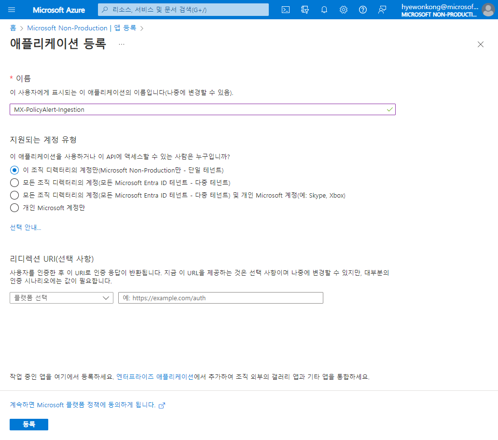d. 등록 후 화면에서 **테넌트ID** 와 **어플리케이션(클라이언트) ID**를 텍스트 문서에 저장하여 나중에 복사하여 붙여넣을 수 있도록 합니다.
   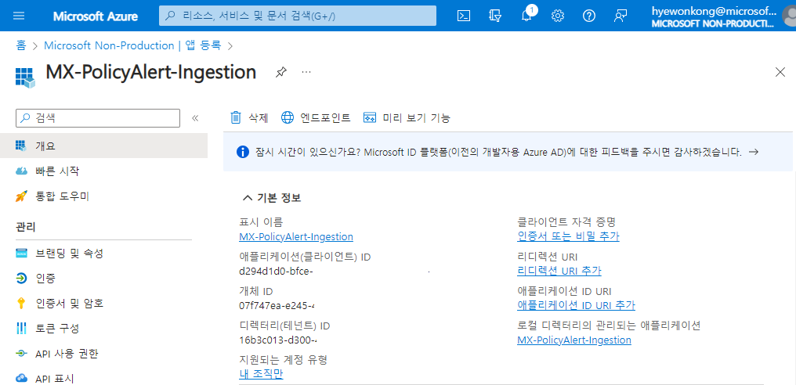 e. 왼쪽 메뉴 [인증서 및 암호]로 이동해서 [클라이언트 비밀]을 선택한 뒤, [+ 새 클라이언트 암호]를 클릭합니다.
   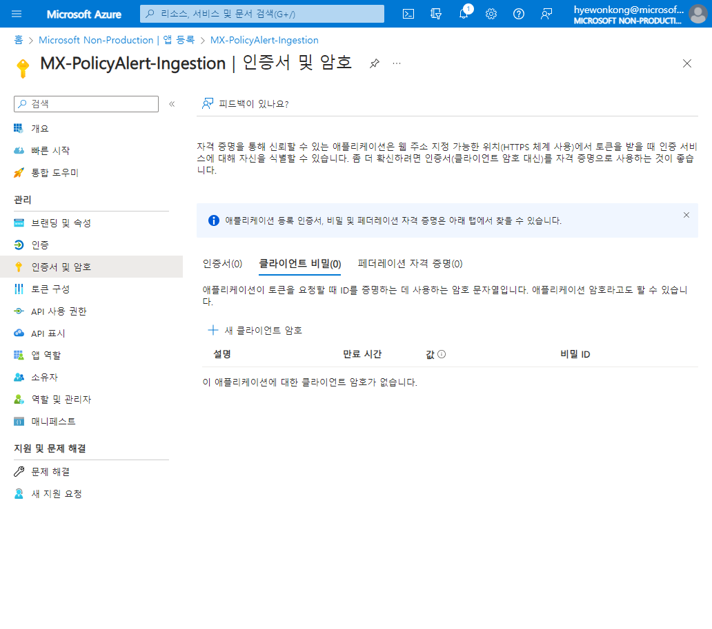 f. '설명'에 사용하려는 이름을 입력하고 만료 시간이 적절한지 확인합니다.
   g. 새 비밀이 생성되면 바로 비밀 값을 복사하여 텍스트 문서에 저장합니다. (주의. 생성 직후에만 비밀 값을 확인할 수 있으며, 다시 확인할 수 없습니다.) 
   *지정한 기간 만료 시, Log Ingestion API를 이용한 데이터 적재에 문제가 발생할 수 있으니 만료 일자를 관리해주셔야 합니다.


### 2.  KeyVault설정

Azure Function의 PowerShell 코드가 비밀 값을 검색 해야하는데, 이따 Plain text로 노출 되는 부분을 없애기 위해 Key Vault 에 안전하게 저장합니다.기존에 생성해 두었던 Key Vault를 이용할 수도 있고, 새롭게 생성해도 됩니다. 

1. 신규 KeyVault 생성
   a. Azure 포털에서 `KeyVault` 또는 `키 자격 증명 모음`을 검색합니다.
   b. [+만들기]를 클릭합니다.
   c. 적절한 리소스 그룹과 지역, 가격 책정 계층을 선택하고 주요 자격 증명 모음 이름을 입력합니다.
       이름: mx-keyvault

   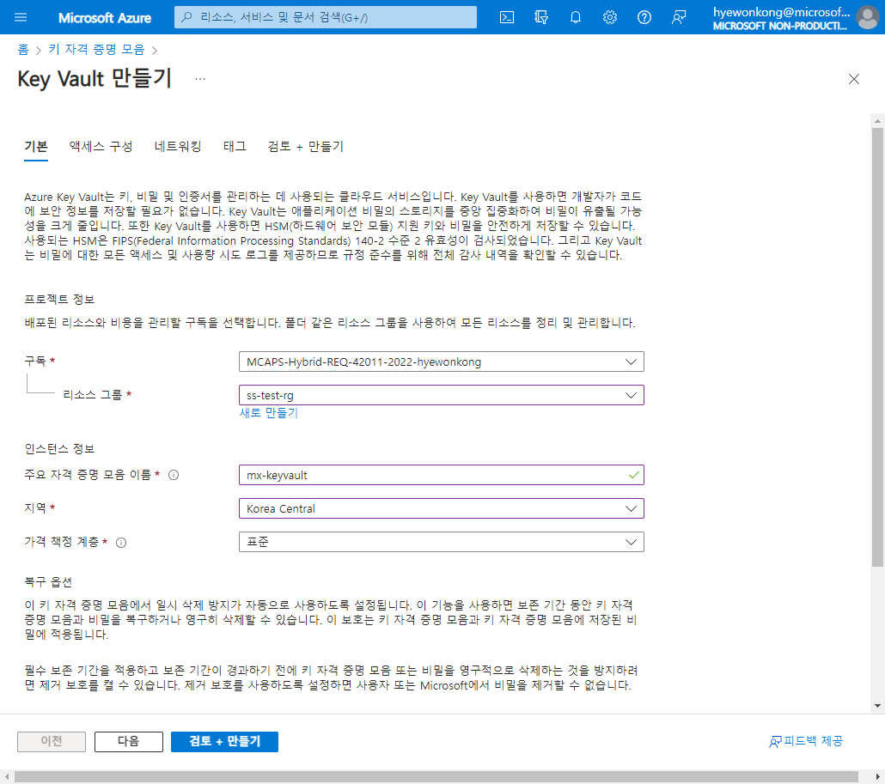

   d. <복구 옵션>에서 적절하게 보존 일수와 제거 보호 옵션을 선택합니다.
        삭제된 자격 증명 모음 보존 일 수 : 90(최소 7일, 최대 90일)
        제거 보호: 보호 제거 사용

   e. 요건에 따라 액세스 구성 및 네트워킹 설정을 완료하고 [검토+만들기] 를 선택합니다.

2. KeyVault에서 왼쪽 메뉴 중 [비밀]을 선택한 다음, [+생성/가져오기]를 클릭합니다.
   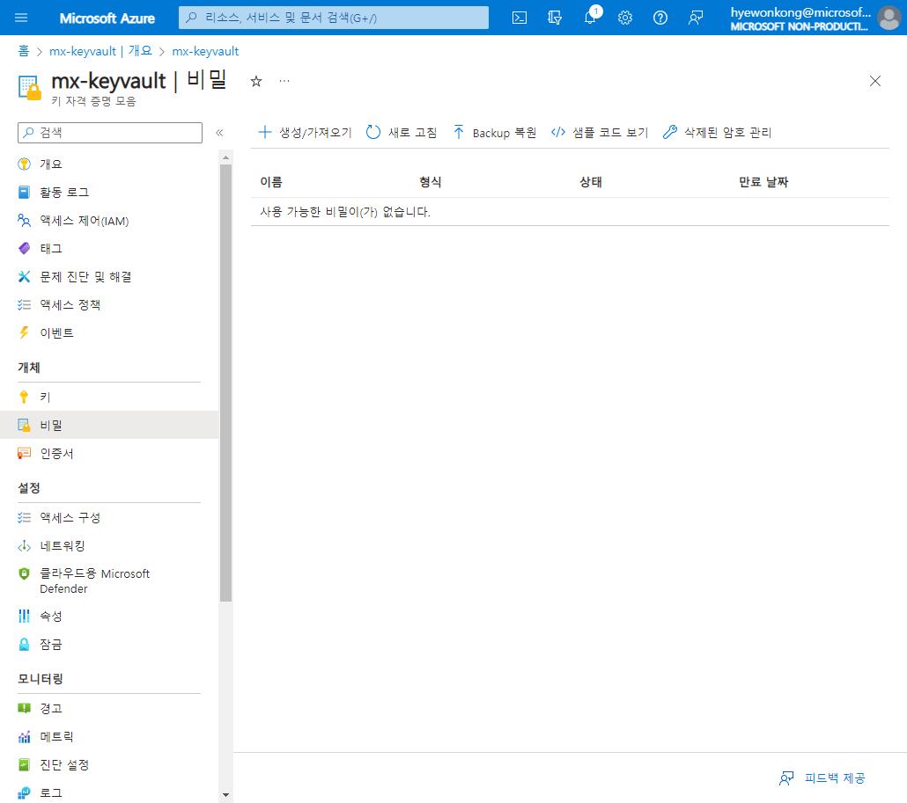

3. 업로드 옵션을 수동으로 하여, 이름과 비밀값을 입력한 뒤 생성합니다.
   이름: PolicyAlert-Secret
   비밀: EntraID App 등록 비밀 

4. 왼쪽 [액세스 구성]을 선택해서 'Azure 역할 기반 액세스 제어'에 체크되어 있는지 확인 합니다.


## 2. 이벤트 감지 및 로그 수집 환경 구성

### 1. Event Grid 설정

EventGrid는 LogAnalytics 작업 영역으로 이벤트를 보낼 수 있도록 PolicyInsights 데이터를 캡쳐합니다.

1. Azure 포털에서 `Event Grid`를 검색합니다.

2. 왼쪽 메뉴에서 [Azure 서비스 이벤트] - [ 시스템 토픽 ]을 선택합니다.

3. [+만들기] 버튼을 클릭합니다.

   a. 항목 유형: Microsoft PolicyInsights
   b. 범위: Azure 구독
   c. 적절한 구독 선택
   d. 적절한 리소스 그룹 선택
   e. 이름: MX-PolicyAlert
   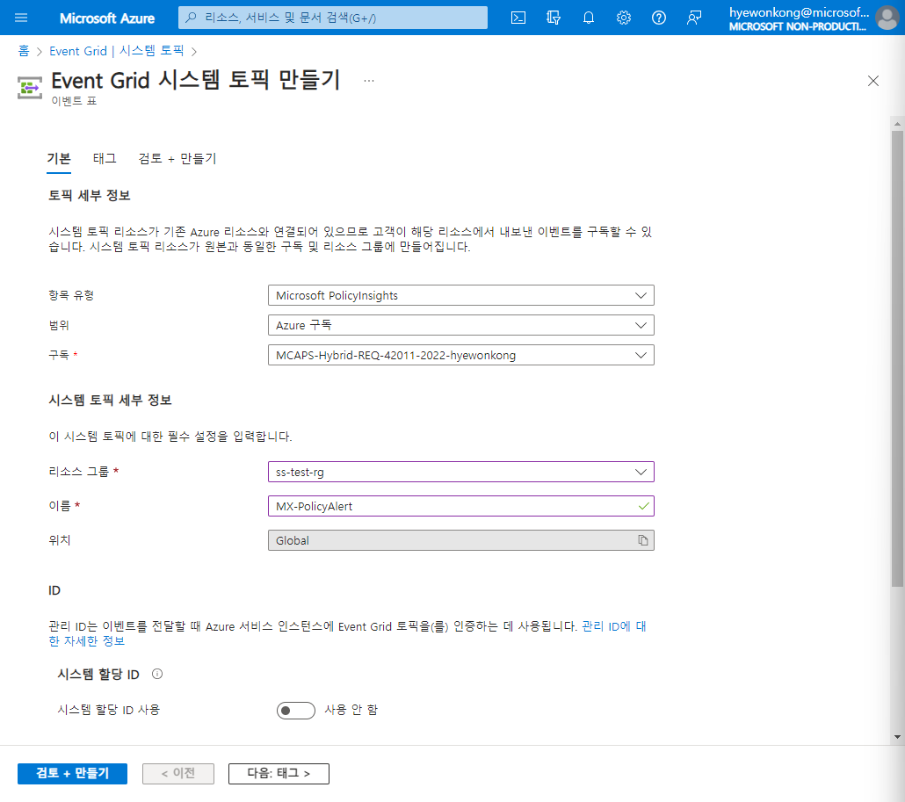


### 2. Azure Function App설정

EventGrid에서 PolicyInsights 데이터를 수집한 다음 Log Analytics 작업 영역에 쓰는데 사용됩니다.

1. 기본 사항
   a. Azure 포털에서 `Function` 또는 `함수 앱`을 검색하여 이동합니다.
   b. [+ 만들기]를 클릭합니다.
   c. EventGrid가 있는 리소스 그룹을 선택합니다.
   d. 이름: MX-PolicyAlert
   e. 코드
   f. 런타임 스택: PowerShell Core
   g. 버전: 7.2
   h. 지역: Korea Central
   i. 운영체제: Windows
   j. 요금제 유형: 사용량(서버리스)
   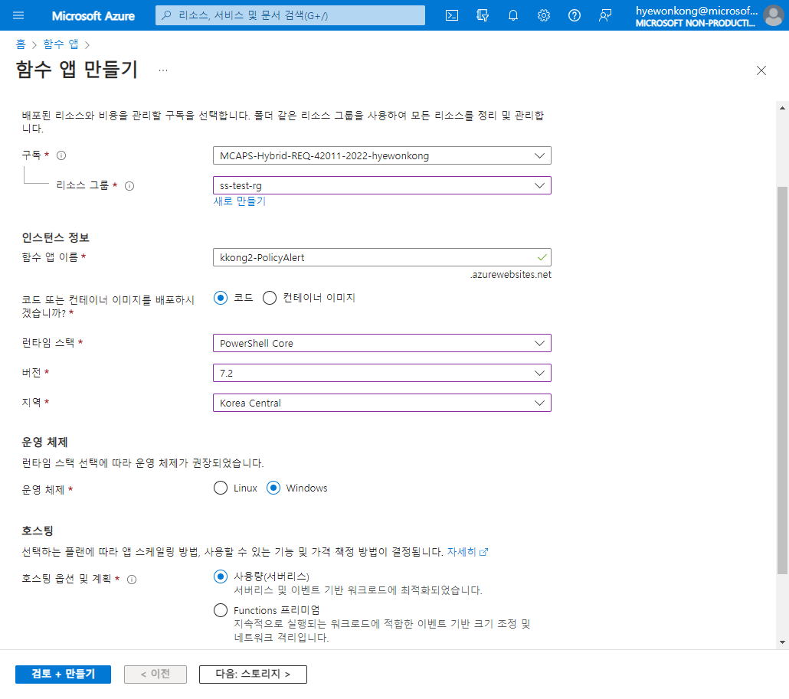

2. 스토리지: 기존에 생성한 스토리지 계정을 선택하거나 자동으로 생성된 스토리지 계정을 선택합니다.

3. 네트워킹: 공용 액세스 켜기

4. 모니터링: Application Insights 활성화

5. 배포: GitHub Actions 설정 사용안함

6. 태그: 필요시 생성

7. 검토 및 생성

8. 함수 앱이 생성이 완료되면 관리ID를 구성해야 합니다.
   a. 생성한 함수앱의 왼쪽 메뉴에서 [ID]를 선택 합니다.
   b.시스템 할당 항목 상태를 '켜기'로 변경 후 저장하여 Azure RBAC을 이용하여 Acess Policy를 관리하도록 합니다.
   c.사용권한-[Azure 역할 할당]을 선택하여 'Key Vault 비밀 사용자'역할을 할당합니다.
   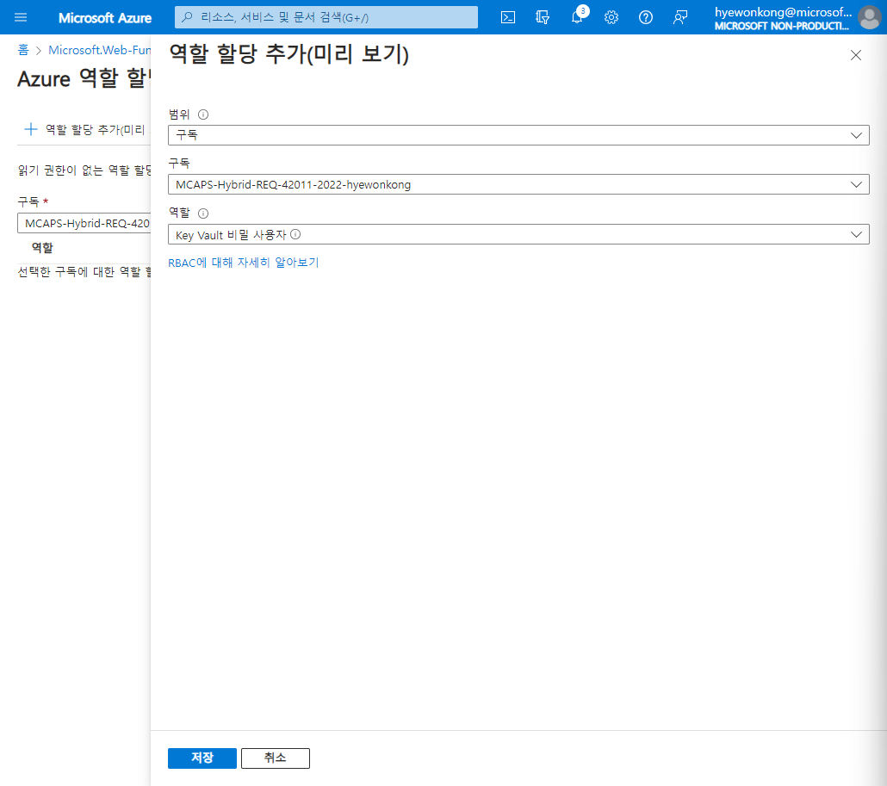

   d.권한 할당이 완료되면 KeyVault로 돌아가 [액세스 제어]-[액세스 권한 확인]-액세스 권한 확인을 선택 후 생성한 관리ID에 권한이 부여됐는지 확인합니다.
   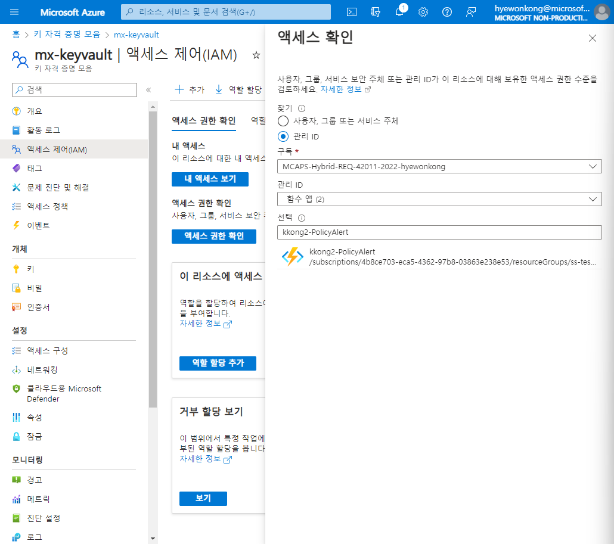
   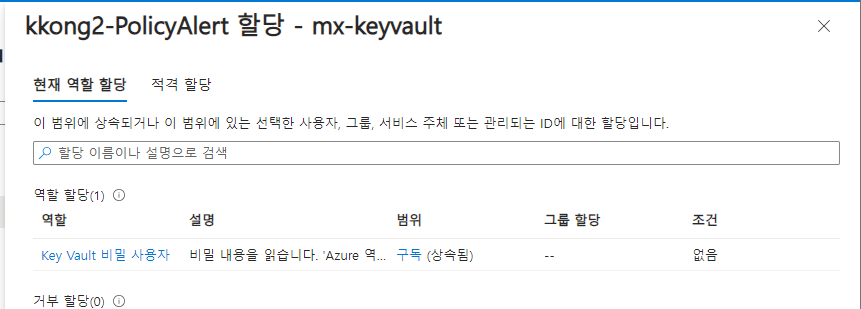


### 3. Function 설정

함수는 EventHub 데이터의 형식을 지정하고 이를 Log Analytics에 쓰는 코드를 실행합니다.

1. 다시 함수 앱으로 돌아와 함수를 생성합니다.
   a. [Azure Portal에서 만들기]를 선택합니다.
   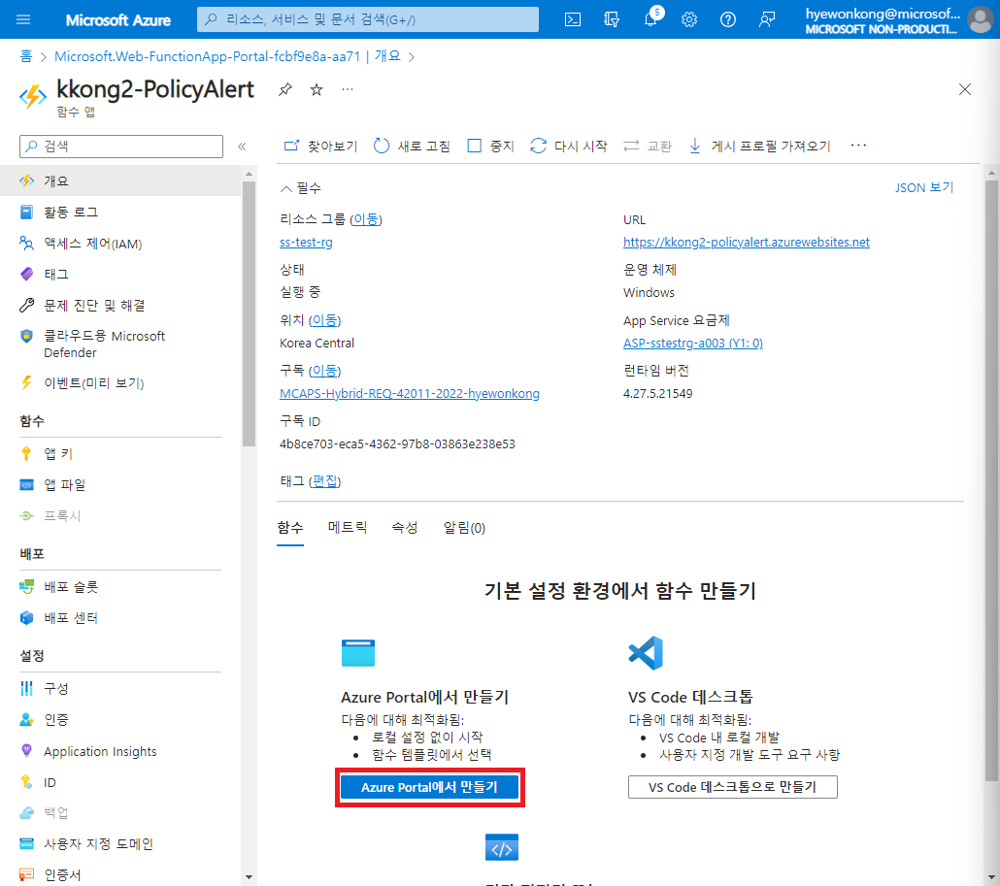
   b. '포털에서 개발'을 그대로 두고, 템플릿 선택에서 'Azure Event Grid trigger'를 선택합니다.
       이름: PolicyAlertTrigger1
   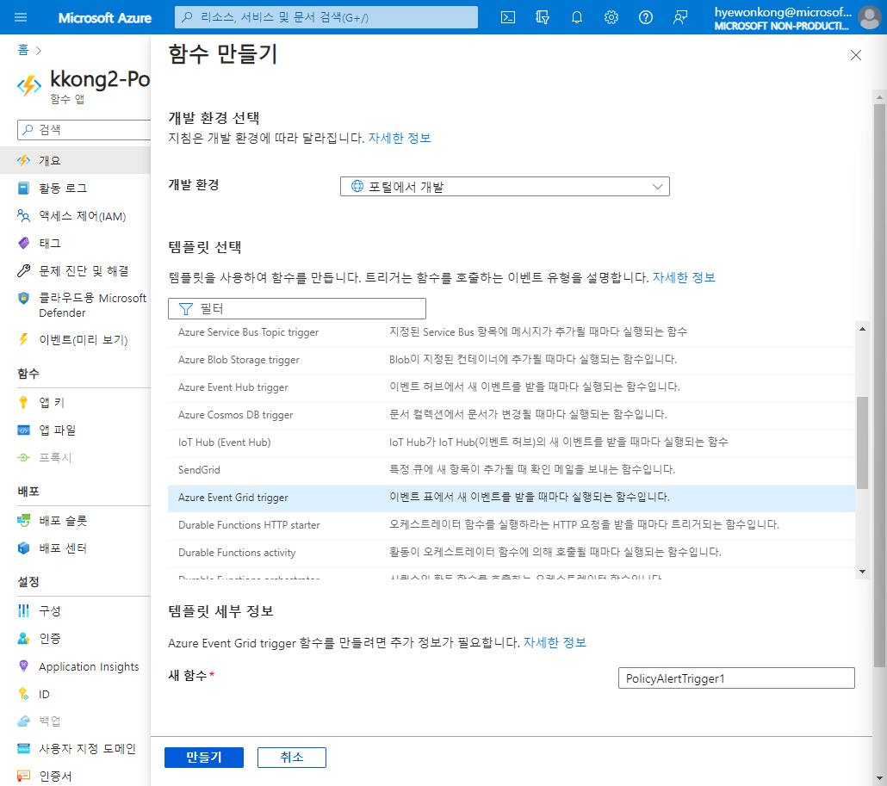

2. 함수가 생성이 완료되면 왼쪽 메뉴에서 '통합'을 선택합니다.
   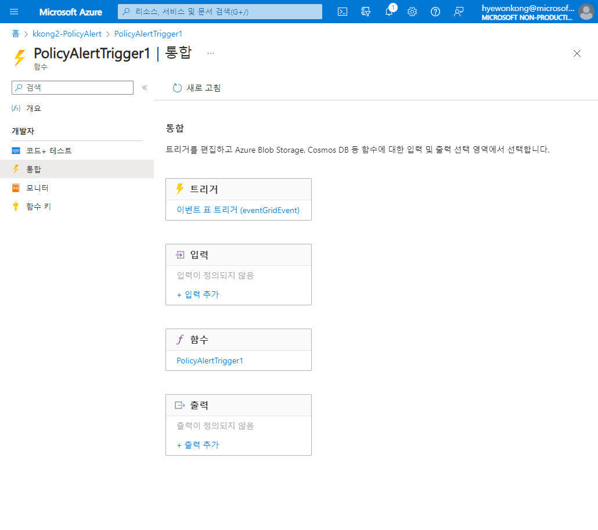

3. 'Trigger'를 선택하면 이벤트 트리거 매개 변수 이름을 확인할 수 있습니다. 
   이를 변경할 수 있으나 함수의 PowerShell 코드에도 맞춰서 변경해줘야합니다.
   

4. 'Event Grid 구독 만들기'를 선택합니다.

   a. 이름: EvtSub-PolicyAlert
   b. 이벤트 스키마: Event Grid 스키마
   c. 항목 유형: Microsoft PolicyInsights
   d. 범위: Azure 구독
   e. 구독 : 적절한 구독 선택
   f. 이벤트 유형: Policy compliance state changed, Policy compliance state created 선택
   g. 엔드포인트 유형: Azure 함수
   h. 엔드포인트: PolicyAlertTrigger1
   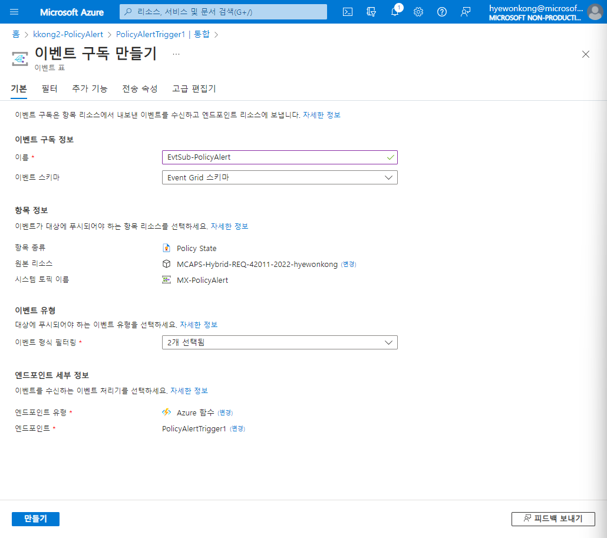


### 4. Functop App 환경 설정

Azure Function에서 PowerShell 환경을 준비 합니다.

1. 생성한 함수 앱으로 이동합니다.
2. 왼쪽 메뉴에서 [ 앱 파일 ]을 선택합니다.
3. 화면 중앙 상단 근처에 드롭다운 메뉴를 클릭하여 'requirements.psd1'을 선택합니다.
   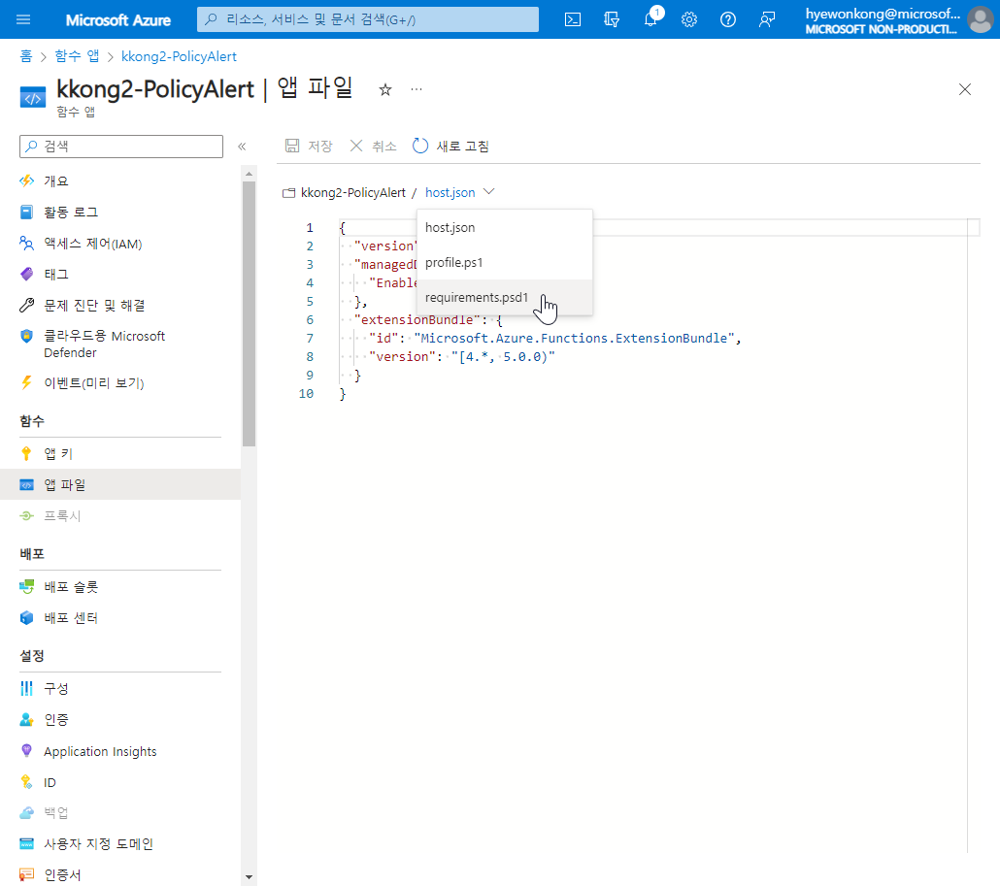
4. 아래와 같이 입력 후 저장합니다.
   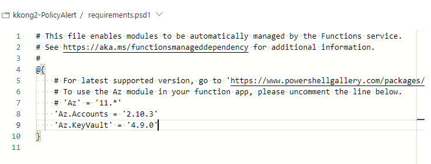
5. 함수 개요 화면에서 '다시 시작'을 실행합니다.


## 3. 로그 수집

### 1. Data Collection Endpoint 설정

DCE는 PolicyInsights 데이터를 Log Analytics에 쓰기 위한 설정입니다.

1. Azure 포털에서 `Monitor`또는 `모니터`를 입력하여 이동합니다.
2. 왼쪽 메뉴에서 [ 데이터 수집 엔드포인트 ]를 선택합니다.
3. [+만들기]를 클릭합니다.
   a. 이름: DCE-PolicyAlerts
   b. 적절한 구독 선택
   c. 적절한 리소스 그룹 선택
   d. 지역: Korea Central
   e. 필요시 태그 설정


### 2. 사용자 지정 테이블 및 Data Collection Rule 설정

1. Azure 포털에서 `Log Analytics 작업영역`을 검색하여 이동합니다.

2. 기존에 있는 작업 영역을 이용하거나 새로 생성합니다.

3. [+만들기]를 선택합니다.
   a. 적절한 구독 선택
   b. 적절한 리소스 그룹 선택
   c. 이름: MX-LAW-PolicyAlert
   d. 지역: Korea Central
   e. 필요시 태그 설정

4. 생성한 작업 영역에서 왼쪽 메뉴 중 [ 테이블 ]을 선택합니다.

5. [+만들기]를 선택한 후 '새 사용자 지정 로그(DCR 기반)'을 선택합니다.

   a. 테이블 이름: PolicyAlert
   b. 데이터 수집 규칙: [새 데이터 수집 규칙 만들기] - DCR-PolicyAlert 입력
   c. 데이터 수집 엔드포인트: 생성한 DCE 선택
   
   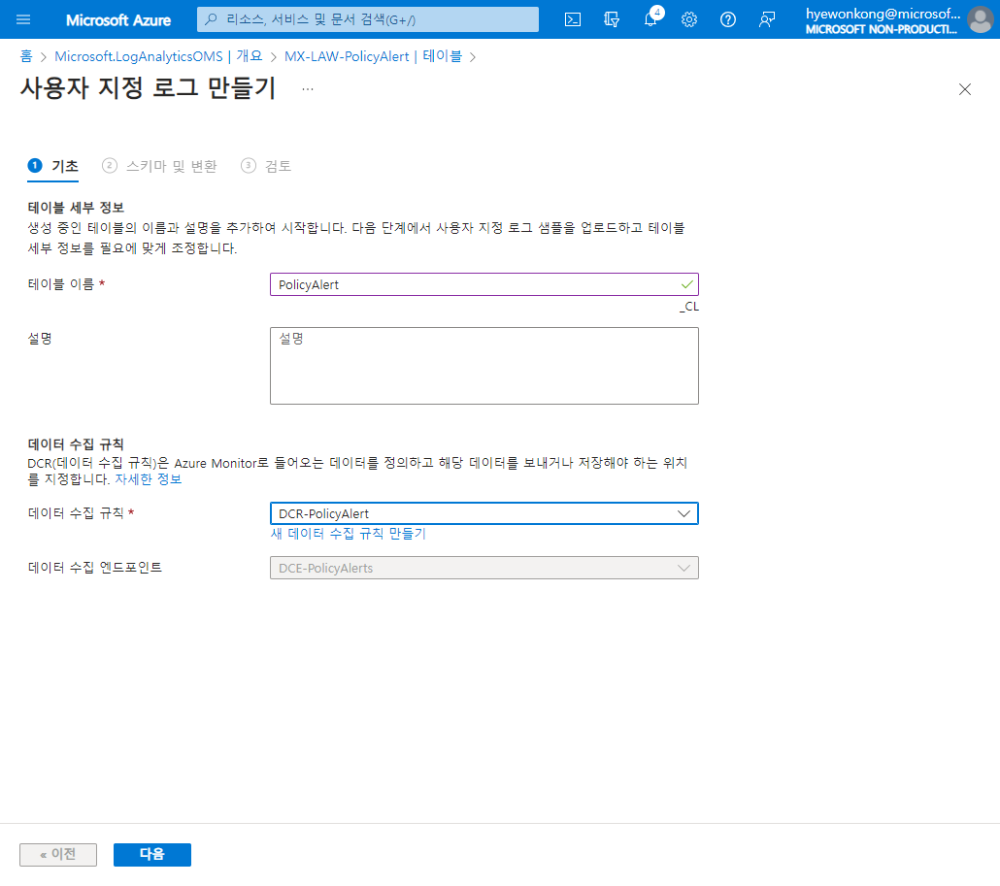
   d. <스키마 및 변환> 단계로 넘어가서 아래 JSON 파일의 정보를 수정한 다음 업로드 합니다.
   topic: subscription id 수정
   policydefinitionid: 정책 정의 ID 입력
   policyassignmentid: 정책 할당 ID 입력
   subscriptionid: 변경

   ```json
   [
       {
           "res_id": "1697973446446A46CE59B582B56374827E208E98B0842AC8FFAA6F304878A304",
           "topic": "/subscriptions/000abcd0-00a0-00a0-0010-a000a10a0ab0",
           "subject": "/subscriptions/000abcd0-00a0-00a0-0010-a000a10a0ab0/resourcegroups/My-RG/providers/microsoft.compute/virtualmachines/My-VM",
           "eventtime": "10/12/2022 20:36:15",
           "event_type": "Microsoft.PolicyInsights.PolicyStateChanged",
           "compliancestate": "NonCompliant",
           "compliancereasoncode": "",
           "policydefinitionid": "/providers/microsoft.authorization/policydefinitions/01a0a011-1234-567a-a123-12a3a45abc67",
           "policyassignmentid": "/subscriptions/000abcd0-00a0-00a0-0010-a000a10a0ab0/providers/microsoft.authorization/policyassignments/securitycenterbuiltin",
           "subscriptionid": "000abcd0-00a0-00a0-0010-a000a10a0ab0",
           "timestamp": "10/12/2022 20:21:33"
       }
   ]
   ```

   e. 샘플 파일을 업로드 한 뒤, 'TimeGenerated' 데이터 필드에 대한 오류가 발생할 수 있습니다.
   '변환 편집기'를 선택한 다음 KQL을 실행한 후 적용을 클릭 합니다.
   `source | extend TimeGenerated = todatetime(timestamp)`
   
   
   f. 다음을 클릭한 후 생성을 완료합니다.


### 3. DCE 액세스 설정

Log Ingestion API를 통해 Log Analytics에 데이터를 쓰는 과정의 일부로 DCE에 대한 액세스를 설정합니다.

1. Azure 포털에서 `모니터`를 입력하여 이동합니다.

2. 왼쪽 메뉴에서 [ 데이터 수집 규칙 ]을 선택합니다.

3. 생성한 DCR을 선택합니다.

4. 왼쪽 메뉴에서 [ 액세스 제어 ]를 선택합니다.

5. '이 리소스에 액세스 권한 부여' - [역할 할당 추가] 를 선택합니다.

   a. 역할에서 '모니터링 메트릭 게시자'를 검색하여 선택합니다.
   b. 구성원에서 생성한 관리 ID를 검색하여 선택합니다.
   c. 검토 및 할당


### 4. Function App 함수 생성

Azure Policy 이벤트 데이터를 수집하는 PowerShell 코드를 Azure Function 에 등록합니다.

1. 생성한 함수를 선택합니다.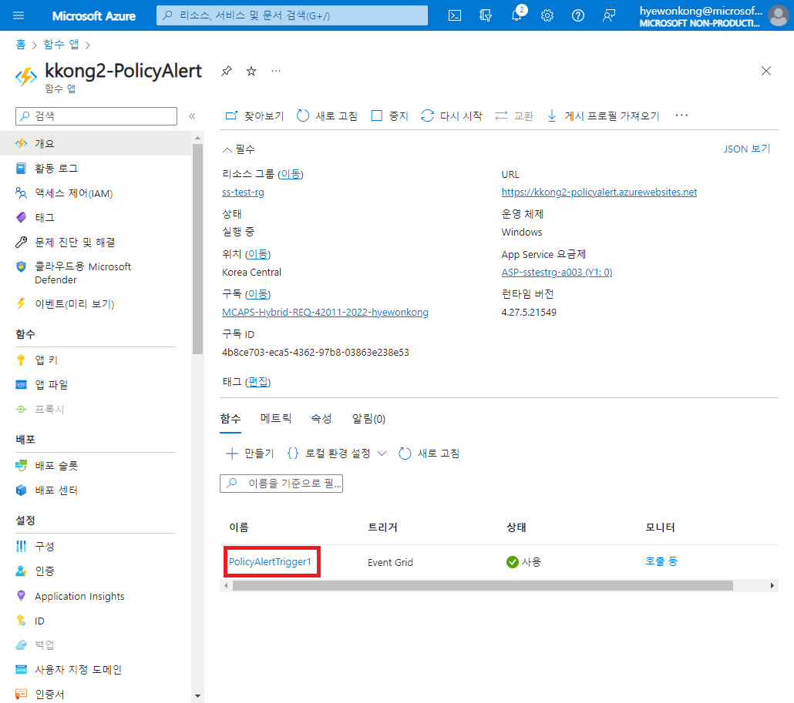

2. 왼쪽 메뉴에서 [ 코드+테스트 ] 를 선택합니다.

3. 아래 코드를 복사하여 붙여넣고, 이전 단계에서 생성한 DCE,DCR의 정보를 추가합니다.
   a. DCE의 로그 수집 엔드포인트를 복하여 넣습니다.
   b. DCR의 Immutabled ID를 복사하여 넣습니다. (DCR 개요 화면에서 기본정보-JSON 보기 선택)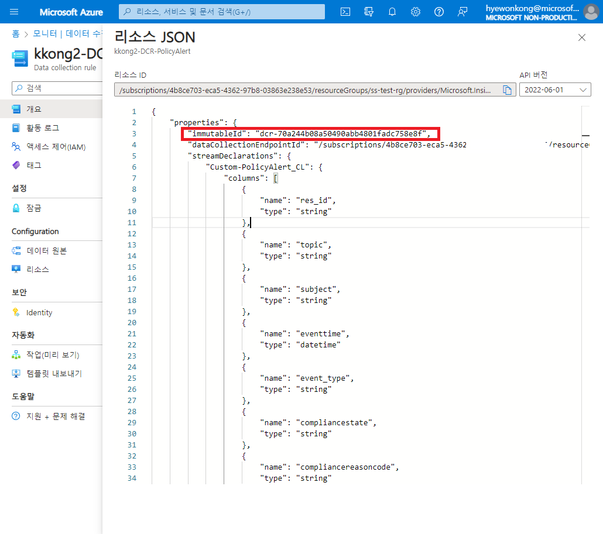

   ```powershell
   param($EventGridEvent, $TriggerMetaData)
   
   ############### BEGIN USER SPECIFIED VARIABLES ###############
   ############### Please fill in values for all Variables in this section. ###############
   
   # Specify the name of the LAW Table that you will be sending data to
   $Table = "PolicyAlert"
   
   # Specify the Immutable ID of the DCR
   $DcrImmutableId = "dcr-MyImmutableID"
   
   # Specify the URI of the DCE
   $DceURI = "https://dce-name.region.ingest.monitor.azure.com"
   
   # Specify the KeyVault Name and the Secret Name
   $KeyVaultName = "KV-PolicyAlert"
   $SecretName = "PolicyAlert-Secret"
   
   # Login to Azure as the Azure FUnction Managed Identity and Grab the Secret from the Keyvault
   Connect-AzAccount -Identity | Out-String | Write-Host
   $appSecret = Get-AzKeyVaultSecret -VaultName $KeyVaultName -Name $SecretName -AsPlainText
   
   # Specify the AAD Tenant ID and Registered App ID in AAD for Accessing the DCE
   $tenantId = "MY-AAD-Tenant-ID"; #the tenant ID in which the Data Collection Endpoint resides
   $appId = "MY-Registered-AppID"; #the app ID created and granted permissions
   
   ############### END USER SPECIFIED VARIABLES ###############
   
   
   # JSON Value
   $json = @"
   [{  "res_id": "$($EventGridEvent.id)",
       "topic": "$($EventGridEvent.topic)",
       "subject": "$($EventGridEvent.subject)",
       "eventtime": "$($EventGridEvent.eventTime)",
       "event_type": "$($EventGridEvent.eventType)",
       "compliancestate": "$($EventGridEvent.data.complianceState)",
       "compliancereasoncode": "$($EventGridEvent.data.complianceReasonCode)",
       "policydefinitionid": "$($EventGridEvent.data.policyDefinitionId)",
       "policyassignmentid": "$($EventGridEvent.data.policyAssignmentId)",
       "subscriptionid": "$($EventGridEvent.data.subscriptionId)",
       "timestamp": "$($EventGridEvent.data.timestamp)"
   }]
   "@
   
   ## Obtain a bearer token used to authenticate against the data collection endpoint
   $scope = [System.Web.HttpUtility]::UrlEncode("https://monitor.azure.com//.default")   
   $body = "client_id=$appId&scope=$scope&client_secret=$appSecret&grant_type=client_credentials";
   $headers = @{"Content-Type" = "application/x-www-form-urlencoded" };
   $uri = "https://login.microsoftonline.com/$tenantId/oauth2/v2.0/token"
   $bearerToken = (Invoke-RestMethod -Uri $uri -Method "Post" -Body $body -Headers $headers).access_token
   
   
   # Sending the data to Log Analytics via the DCR!
   $body = $json
   $headers = @{"Authorization" = "Bearer $bearerToken"; "Content-Type" = "application/json" };
   $uri = "$DceURI/dataCollectionRules/$DcrImmutableId/streams/Custom-$Table"+"_CL?api-version=2021-11-01-preview";
   $uploadResponse = Invoke-RestMethod -Uri $uri -Method "Post" -Body $body -Headers $headers;
   
   $uploadResponse | Out-String | Write-Host
   ```


## 4. Alert 생성

### 1. Alert 설정

Azure Monitor내에서 알림 설정을 진행합니다.

1. 생성한 Log Analytics 작업엉역으로 이동합니다.

2. 왼쪽 메뉴에서 [ 로그 ]를 선택한 후 쿼리 선택창이 나올 경우 닫기 버튼을 클릭 합니다.

3. 쿼리 창에 아래 쿼리를 입력 후 실행합니다.
   ```
   PolicyAlert_CL
   | where event_type =~ "Microsoft.PolicyInsights.PolicyStateCreated" or event_type =~ "Microsoft.PolicyInsights.PolicyStateChanged"
   | where compliancestate =~ "NonCompliant"
   | extend TimeStamp = timestamp
   | extend Event_Type = event_type
   | extend Resource_Id = subject
   | extend Subscription_Id = subscriptionid
   | extend Compliance_State = compliancestate
   | extend Policy_Definition = policydefinitionid
   | extend Policy_Assignment = policyassignmentid
   | extend Compliance_Reason_Code = compliancereasoncode
   | project TimeStamp, Resource_Id, Subscription_Id, Policy_Assignment, Policy_Definition, Compliance_State, Compliance_Reason_Code
   ```

4. [+ 새 경고 규칙]을 클릭합니다.

5. 측정값과 관련된 옵션을 확인한 다음, 경고 논리 값을 설정합니다.
   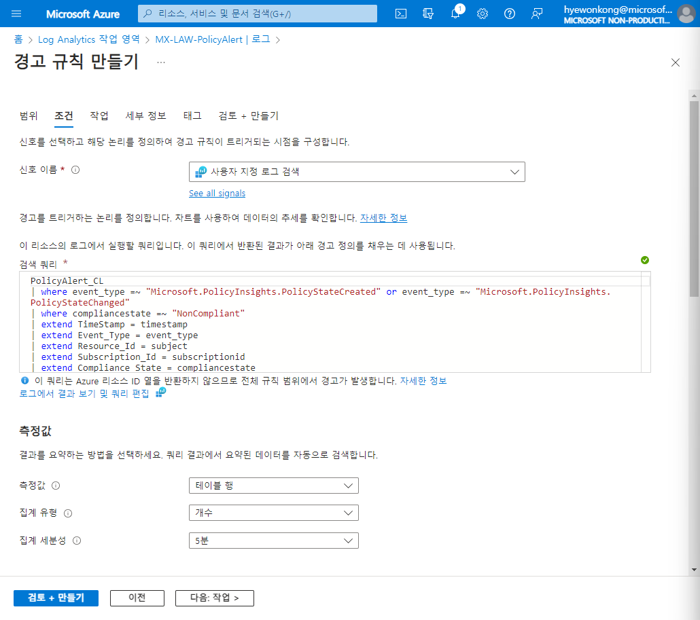
   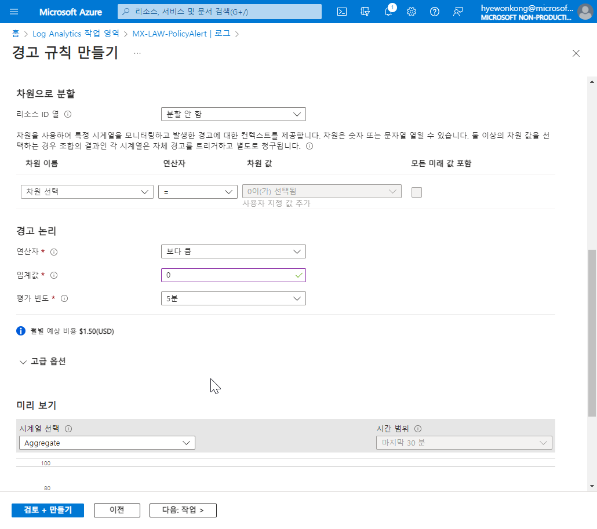

6. 다음으로 넘어가서 알람을 받은 작업 그룹을 선택합니다. (없을 경우 신규 생)
   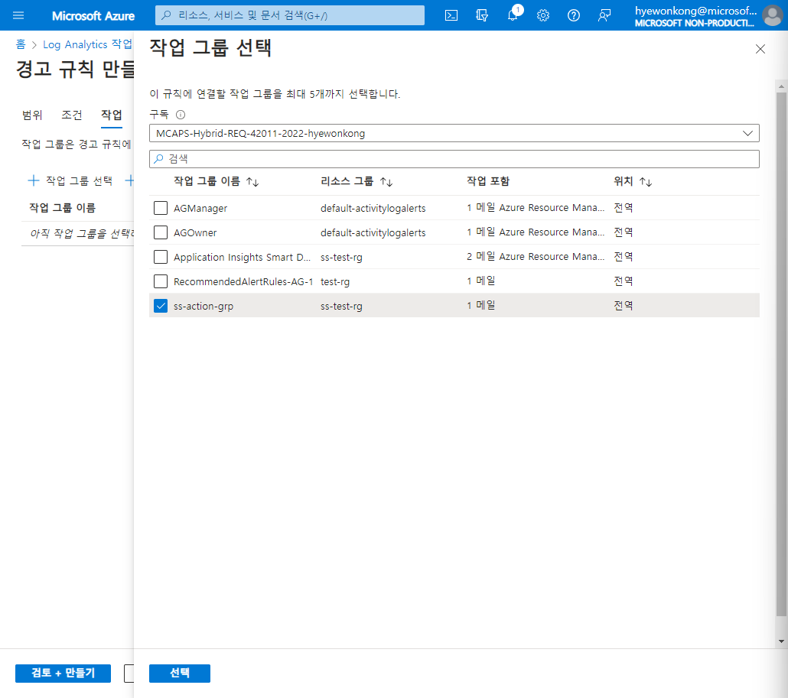

7. 경고 규칙 이름을 지정합니다.
   이름: MX-PolicyStateChanged
   

8. 검토 후 생성


### 2. 결과 확인

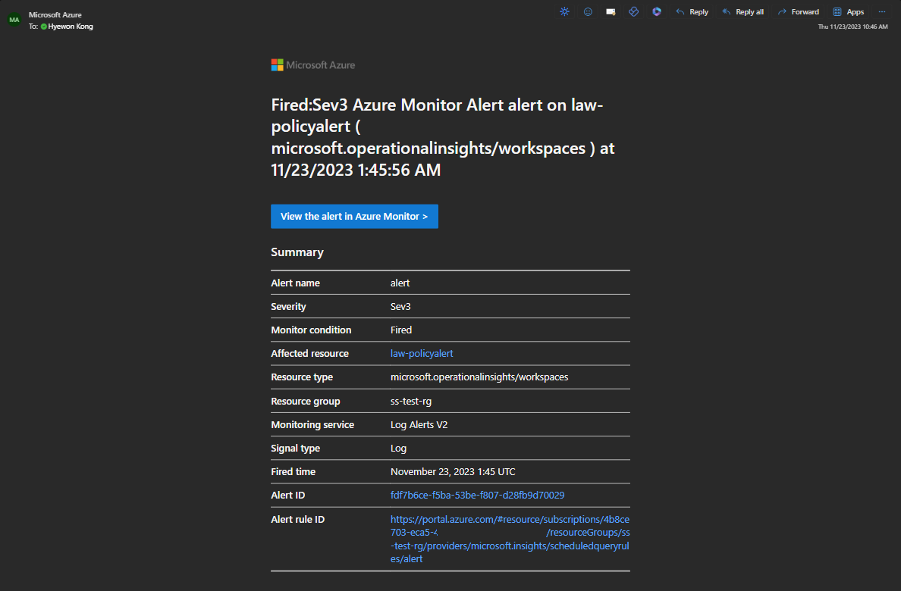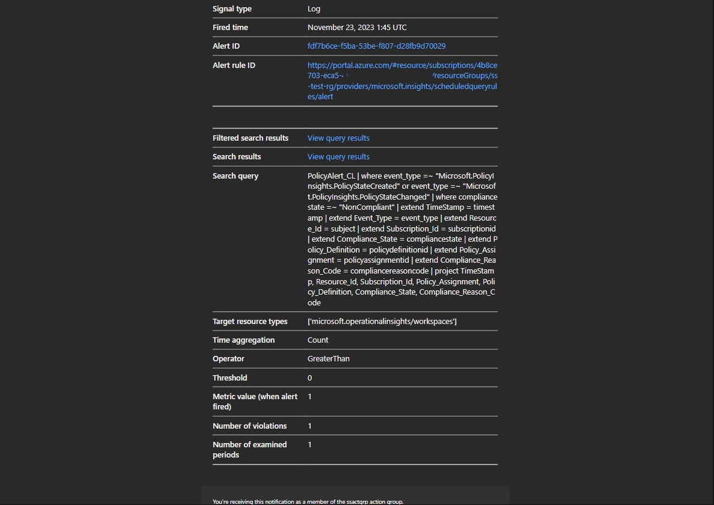
